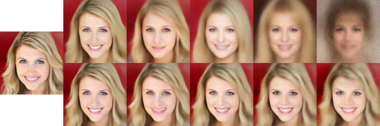
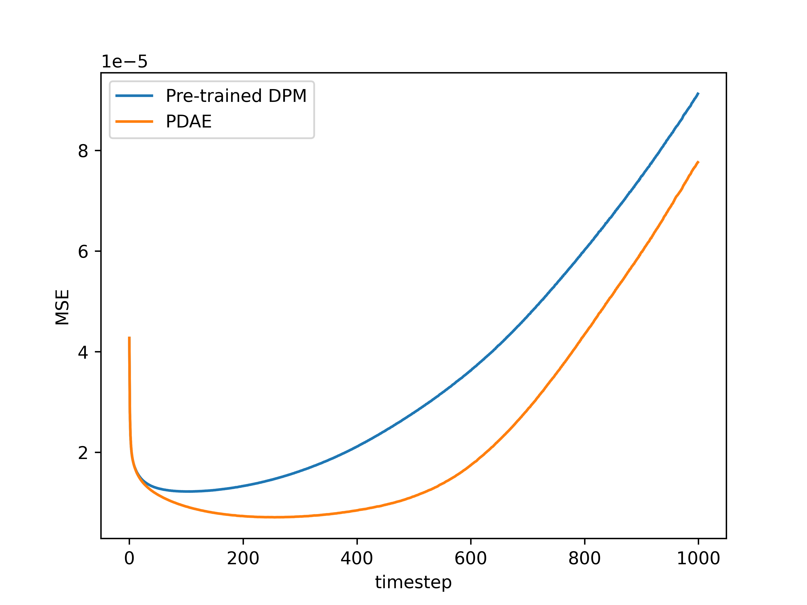
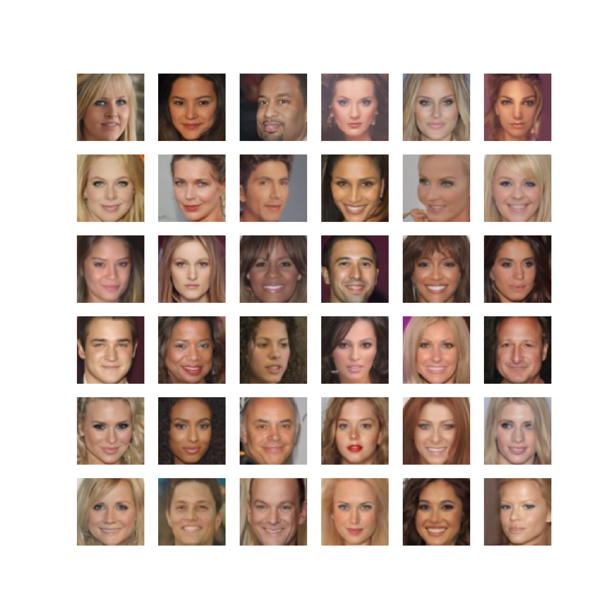

# Unsupervised Representation Learning from Pre-trained Diffusion Probabilistic Models (PDAE)

This repository is official PyTorch implementation of [PDAE](https://arxiv.org/abs/2212.12990) (NeurIPS 2022).

```
@article{zhang2022unsupervised,
  title={Unsupervised Representation Learning from Pre-trained Diffusion Probabilistic Models},
  author={Zhang, Zijian and Zhao, Zhou and Lin, Zhijie},
  journal={arXiv preprint arXiv:2212.12990},
  year={2022}
}
```


## Dataset

We use the LMDB ready-to-use datasets provided by Diff-AE ([https://github.com/phizaz/diffae#lmdb-datasets](https://github.com/phizaz/diffae#lmdb-datasets)).

The directory structure should be:

```
data
├─horse
|   ├─data.mdb
|   └lock.mdb
├─ffhq
|  ├─data.mdb
|  └lock.mdb
├─celebahq
|    ├─CelebAMask-HQ-attribute-anno.txt
|    ├─data.mdb
|    └lock.mdb
├─celeba64
|    ├─data.mdb
|    └lock.mdb
├─bedroom
|    ├─data.mdb
|    └lock.mdb
```


## Download

[pre-trained-dpms](https://drive.google.com/drive/folders/1mU6zgo8WYjNmUtLXZAcsXzv8RghWN9zv?usp=share_link) (required)

[trained-models](https://drive.google.com/drive/folders/1yDeQCRQdDnrLH9HyJnHJBtOS_ZqbHSl7?usp=share_link) (optional)

You should put download in the root dicretory of this project and maintain their directory structure as shown in Google Drive.


## Training

To train PDAE, run this command:

```train
cd ./trainer
CUDA_VISIBLE_DEVICES=0,1,2,3 python3 train_representation_learning.py --world_size 4
```


To train a classifier for manipulation, run this command:

```
cd ./trainer
CUDA_VISIBLE_DEVICES=0,1,2,3 python3 train_manipulation_diffusion.py --world_size 4
```


To train a latent DPM, run this command:

```
cd ./trainer
CUDA_VISIBLE_DEVICES=0,1,2,3 python3 train_latent_diffusion.py --world_size 4
```


You can change the config file and run path in the python file.


## Evaluation

```
cd ./sampler
CUDA_VISIBLE_DEVICES=0 python3 autoencoding_example.py
```

<div align=center></div>


```
cd ./sampler
CUDA_VISIBLE_DEVICES=0 python3 denoise_one_step.py
```

<div align=center></div>


```
cd ./sampler
CUDA_VISIBLE_DEVICES=0,1,2,3 python3 gap_measure.py --world_size 4
```

<div align=center></div>


```
cd ./sampler
CUDA_VISIBLE_DEVICES=0 python3 interpolation.py
```

<div align=center></div>


```
cd ./sampler
CUDA_VISIBLE_DEVICES=0 python3 manipulation.py
```

<div align=center></div>


```
cd ./sampler
CUDA_VISIBLE_DEVICES=0,1,2,3 python3 unconditional_sample.py --world_size 4
```

<div align=center></div>

